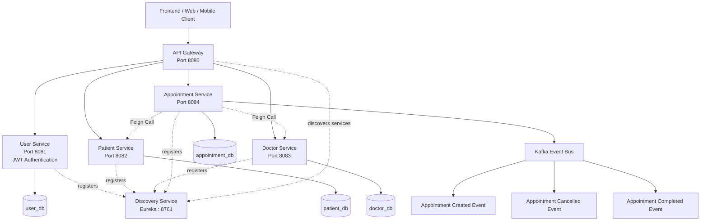

# Hospital Management Microservices

A complete microservices architecture implementation for a Hospital Management System using Spring Boot, Spring Cloud, Kafka, and modern microservices patterns.

## Architecture Overview

### Microservices

1. **Discovery Service** (Port: 8761) - Eureka Server for service discovery
2. **API Gateway** (Port: 8080) - Single entry point for all API requests
3. **User Service** (Port: 8081) - User management and authentication (JWT)
4. **Patient Service** (Port: 8082) - Patient and insurance management
5. **Doctor Service** (Port: 8083) - Doctor and department management
6. **Appointment Service** (Port: 8084) - Appointment booking with inter-service communication

### Technology Stack

- **Spring Boot 3.2.5** - Core framework
- **Spring Cloud 2023.0.1** - Microservices infrastructure
- **Spring Cloud Gateway** - API Gateway
- **Eureka Server** - Service discovery
- **OpenFeign** - Inter-service communication
- **Kafka** - Event-driven architecture
- **Resilience4j** - Circuit breaker, retry, rate limiting
- **MySQL** - Database (database per service)
- **JWT** - Authentication
- **ModelMapper** - DTO mapping
- **Debezium** - Change Data Capture (CDC)

## Prerequisites

- Java 21 or higher
- Maven 3.8+
- MySQL 8.0+
- Apache Kafka 2.8+ (for event streaming)
- Docker (optional, for Kafka)

## Database Setup

Create the following databases in MySQL:

```sql
CREATE DATABASE user_db;
CREATE DATABASE patient_db;
CREATE DATABASE doctor_db;
CREATE DATABASE appointment_db;
```

Default database credentials (update in each service's `application.yml` if needed):
- Username: `root`
- Password: `root`
- Port: `3306`

## Kafka Setup

### Option 1: Using Docker

```bash
docker run -d --name kafka -p 9092:9092 \
  -e KAFKA_ZOOKEEPER_CONNECT=zookeeper:2181 \
  -e KAFKA_ADVERTISED_LISTENERS=PLAINTEXT://localhost:9092 \
  -e KAFKA_OFFSETS_TOPIC_REPLICATION_FACTOR=1 \
  confluentinc/cp-kafka:latest
```

### Option 2: Local Installation

Download and install Apache Kafka from https://kafka.apache.org/downloads

Start Zookeeper:
```bash
bin/zookeeper-server-start.sh config/zookeeper.properties
```

Start Kafka:
```bash
bin/kafka-server-start.sh config/server.properties
```

## Project Structure

```
hospital-management-microservices/
├── common/                    # Shared DTOs and events
├── discovery-service/         # Eureka Server
├── api-gateway/               # API Gateway
├── user-service/              # User management & auth
├── patient-service/           # Patient management
├── doctor-service/            # Doctor management
├── appointment-service/       # Appointment management
├── debezium-config/           # CDC configuration
└── pom.xml                    # Parent POM
```

## Running the Application

### Step 1: Build the Project

```bash
cd hospital-management-microservices
mvn clean install
```

### Step 2: Start Services in Order

1. **Start Discovery Service**
```bash
cd discovery-service
mvn spring-boot:run
```

2. **Start API Gateway**
```bash
cd api-gateway
mvn spring-boot:run
```

3. **Start User Service**
```bash
cd user-service
mvn spring-boot:run
```

4. **Start Patient Service**
```bash
cd patient-service
mvn spring-boot:run
```

5. **Start Doctor Service**
```bash
cd doctor-service
mvn spring-boot:run
```

6. **Start Appointment Service**
```bash
cd appointment-service
mvn spring-boot:run
```

### Step 3: Verify Services

- **Eureka Dashboard**: http://localhost:8761
- **API Gateway**: http://localhost:8080
- **Health Checks**: http://localhost:8080/actuator/health

## API Endpoints

### Authentication (via User Service)

```bash
# Register User
POST http://localhost:8080/api/v1/auth/register
Content-Type: application/json
{
  "username": "john_doe",
  "password": "password123",
  "email": "john@example.com",
  "role": "PATIENT"
}

# Login
POST http://localhost:8080/api/v1/auth/login
Content-Type: application/json
{
  "username": "john_doe",
  "password": "password123"
}
```

### Patients (via Patient Service)

```bash
# Create Patient
POST http://localhost:8080/api/v1/patients
Content-Type: application/json
{
  "name": "John Doe",
  "birthDate": "1990-01-01",
  "email": "john@example.com",
  "gender": "MALE",
  "bloodGroup": "A_POSITIVE",
  "userId": 1
}

# Get Patient by ID
GET http://localhost:8080/api/v1/patients/1

# Get Patient by User ID
GET http://localhost:8080/api/v1/patients/user/1
```

### Doctors (via Doctor Service)

```bash
# Create Doctor
POST http://localhost:8080/api/v1/doctors
Content-Type: application/json
{
  "name": "Dr. Smith",
  "specialization": "Cardiology",
  "email": "smith@example.com",
  "departments": ["Cardiology", "Internal Medicine"],
  "userId": 2
}

# Get All Doctors
GET http://localhost:8080/api/v1/doctors

# Get Doctor by ID
GET http://localhost:8080/api/v1/doctors/1
```

### Appointments (via Appointment Service)

```bash
# Create Appointment
POST http://localhost:8080/api/v1/appointments
Content-Type: application/json
{
  "appointmentTime": "2024-12-01 10:00:00",
  "reason": "Regular checkup",
  "patientId": 1,
  "doctorId": 1
}

# Get Appointment by ID
GET http://localhost:8080/api/v1/appointments/1

# Cancel Appointment
PUT http://localhost:8080/api/v1/appointments/1/cancel

# Complete Appointment
PUT http://localhost:8080/api/v1/appointments/1/complete
```

## Features Implemented

### 1. Service Discovery
- Eureka Server for service registration and discovery
- Automatic service registration on startup
- Service health monitoring

### 2. API Gateway
- Single entry point for all microservices
- Request routing based on service names
- Load balancing via Eureka
- Circuit breaker integration

### 3. Inter-Service Communication
- OpenFeign for synchronous communication
- Service-to-service calls via Eureka
- Load balancing and failover

### 4. Event-Driven Architecture
- Kafka for asynchronous event publishing
- Appointment events (CREATED, CANCELLED, COMPLETED)
- Decoupled service communication

### 5. Resilience Patterns
- Circuit Breaker (Resilience4j)
- Fallback methods for service failures
- Retry mechanisms
- Rate limiting

### 6. Authentication & Authorization
- JWT-based authentication
- User service for auth management
- Role-based access control

### 7. Database per Service
- Separate databases for each service
- Data isolation
- Independent scaling

## Change Data Capture (CDC) with Debezium

Configuration file provided in `debezium-config/postgres-connector.json`

To enable CDC:

1. Start Kafka Connect
```bash
bin/connect-distributed.sh config/connect-distributed.properties
```

2. Register Debezium connector
```bash
curl -X POST -H "Content-Type: application/json" \
  --data @debezium-config/postgres-connector.json \
  http://localhost:8083/connectors
```

3. Monitor CDC events
```bash
bin/kafka-console-consumer.sh --bootstrap-server localhost:9092 \
  --topic hospital.public.appointments
```

## Monitoring

### Health Checks
```bash
# All services expose health endpoints
http://localhost:8081/actuator/health
http://localhost:8082/actuator/health
http://localhost:8083/actuator/health
http://localhost:8084/actuator/health
```

### Eureka Dashboard
- URL: http://localhost:8761
- View registered services
- Monitor service health

## Circuit Breaker Configuration

All services have circuit breakers configured with:
- Failure rate threshold: 50%
- Wait duration in open state: 5 seconds
- Sliding window size: 10

Fallback methods are implemented for critical service calls.

## Development

### Adding a New Service

1. Create new module in parent POM
2. Add Eureka client dependency
3. Configure service name and port
4. Implement business logic
5. Add Feign clients if needed
6. Register with Eureka

### Testing Inter-Service Communication

Use the API Gateway to test service communication:
```bash
# Test Patient Service through Gateway
curl http://localhost:8080/api/v1/patients/1

# Test Doctor Service through Gateway
curl http://localhost:8080/api/v1/doctors/1
```

## Troubleshooting

### Services not registering with Eureka
- Check Eureka server is running on port 8761
- Verify service URLs in application.yml
- Check network connectivity

### Kafka connection issues
- Ensure Kafka is running on port 9092
- Check bootstrap-servers configuration
- Verify Kafka topic creation

### Database connection issues
- Verify PostgreSQL is running
- Check database credentials
- Ensure databases are created

### Circuit breaker always open
- Adjust failure-rate-threshold in configuration
- Check service health
- Review fallback implementation

## Future Enhancements

- [ ] Add distributed tracing (Zipkin/Sleuth)
- [ ] Implement OAuth2 for external authentication
- [ ] Add Redis caching layer
- [ ] Implement Elasticsearch for search
- [ ] Add Prometheus + Grafana for monitoring
- [ ] Containerize with Docker
- [ ] Orchestrate with Kubernetes
- [ ] Add API versioning
- [ ] Implement rate limiting at gateway level
- [ ] Add request/response logging

## License

This project is created for educational purposes.

## Contact

For questions or issues, please open an issue in the repository.

## System Architecture


