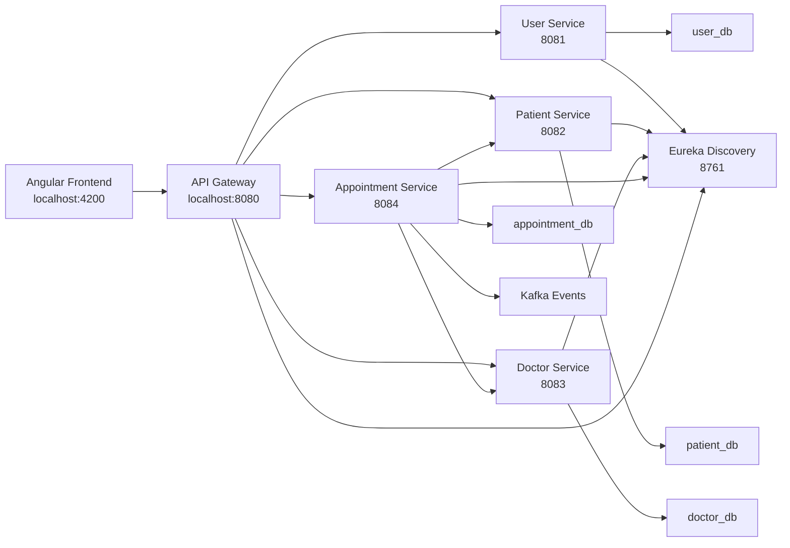

# Hospital Management Microservices - Codex Architecture Notes

This project is a hospital management system built with a microservices architecture. It has an Angular frontend, multiple Spring Boot backend services, Eureka service discovery, an API Gateway, MySQL databases, Feign-based service communication, and Kafka-based event publishing.

## Big Picture



## Frontend

Folder:

```text
hospital-frontend
```

Runs on:

```text
http://localhost:4200
```

The frontend is built with Angular. It calls the backend through the API Gateway:

```text
http://localhost:8080/api/v1
```

Example:

```text
POST http://localhost:8080/api/v1/patients
```

The frontend should normally call the API Gateway only, not the individual backend service ports directly.

## API Gateway

Folder:

```text
api-gateway
```

Port:

```text
8080
```

The API Gateway is the single backend entry point. It receives requests from the frontend and routes them to the correct microservice.

Routes:

```text
/api/v1/auth/**         -> user-service
/api/v1/users/**        -> user-service
/api/v1/patients/**     -> patient-service
/api/v1/doctors/**      -> doctor-service
/api/v1/appointments/** -> appointment-service
```

The gateway uses Eureka to discover service locations. It also contains CORS configuration so the Angular frontend at `http://localhost:4200` can call the backend.

## Discovery Service

Folder:

```text
discovery-service
```

Port:

```text
8761
```

This is the Eureka Server. All backend services register themselves here. The API Gateway then uses Eureka to locate services by name.

Example service names:

```text
user-service
patient-service
doctor-service
appointment-service
```

Eureka dashboard:

```text
http://localhost:8761
```

## User Service

Folder:

```text
user-service
```

Port:

```text
8081
```

Database:

```text
user_db
```

Responsibilities:

- User registration
- User login
- JWT token generation
- JWT token validation
- User role management

Main gateway endpoints:

```text
POST /api/v1/auth/register
POST /api/v1/auth/login
GET  /api/v1/auth/validate
```

## Patient Service

Folder:

```text
patient-service
```

Port:

```text
8082
```

Database:

```text
patient_db
```

Responsibilities:

- Create patient profile
- Get patient by ID
- Get patient by user ID
- Update patient
- Delete patient

The Angular patient form calls this service through the API Gateway.

## Doctor Service

Folder:

```text
doctor-service
```

Port:

```text
8083
```

Database:

```text
doctor_db
```

Responsibilities:

- Create doctor profile
- List doctors
- Get doctor by ID
- Get doctor by user ID
- Manage specialization
- Manage departments

## Appointment Service

Folder:

```text
appointment-service
```

Port:

```text
8084
```

Database:

```text
appointment_db
```

Responsibilities:

- Create appointments
- Get appointments
- Cancel appointments
- Complete appointments
- Validate patient before booking
- Validate doctor before booking
- Publish appointment events using Kafka

This service communicates with Patient Service and Doctor Service using OpenFeign.

## Common Module

Folder:

```text
common
```

The common module contains shared DTOs, event classes, validation objects, and reusable code used by multiple services.

This avoids duplicating the same request, response, or event classes in every service.

## Database Architecture

The project uses the database-per-service pattern.

```text
user-service        -> user_db
patient-service     -> patient_db
doctor-service      -> doctor_db
appointment-service -> appointment_db
```

Each service owns its own database. Other services should not directly read another service's database. If they need data, they should call that service through an API or use events.

## Communication Types

### Frontend to Backend

The Angular app calls the API Gateway using HTTP.

```text
Angular -> API Gateway -> Target Microservice
```

### Gateway to Services

The API Gateway routes requests using Spring Cloud Gateway and Eureka.

```text
Gateway -> Eureka lookup -> Service instance
```

### Service to Service

Appointment Service uses OpenFeign to call Patient Service and Doctor Service.

```text
Appointment Service -> Patient Service
Appointment Service -> Doctor Service
```

### Async Events

Appointment Service publishes appointment events using Kafka.

```text
Appointment Service -> Kafka
```

## Request Flow: Create Patient

```text
1. Angular frontend sends POST /api/v1/patients
2. API Gateway receives request on port 8080
3. Gateway routes request to Patient Service
4. Patient Service saves patient in patient_db
5. Patient Service returns response
6. Gateway returns response to Angular
```

## Request Flow: Create Appointment

```text
1. Angular frontend sends POST /api/v1/appointments
2. API Gateway routes request to Appointment Service
3. Appointment Service validates patient using Patient Service
4. Appointment Service validates doctor using Doctor Service
5. Appointment Service saves appointment in appointment_db
6. Appointment Service publishes Kafka event
7. Appointment Service returns appointment response
8. Gateway returns response to Angular
```

## Main Technologies Used

Backend:

- Java 21
- Spring Boot 3.2.5
- Spring Cloud 2023.0.1
- Spring Cloud Gateway
- Eureka Server and Eureka Client
- Spring Data JPA
- MySQL
- Spring Security
- JWT
- OpenFeign
- Kafka
- Resilience4j
- ModelMapper
- Maven
- Lombok

Frontend:

- Angular 20
- TypeScript
- RxJS
- Angular Router
- Angular Forms

## Service Ports

| Component | Port | Purpose |
| --- | ---: | --- |
| Angular Frontend | 4200 | Browser UI |
| Discovery Service | 8761 | Eureka registry |
| API Gateway | 8080 | Main backend entry point |
| User Service | 8081 | Users and authentication |
| Patient Service | 8082 | Patient management |
| Doctor Service | 8083 | Doctor management |
| Appointment Service | 8084 | Appointment management |
| MySQL | 3306 | Database server |
| Kafka | 9092 | Message broker |

## Useful URLs

```text
Frontend App:
http://localhost:4200

Eureka Dashboard:
http://localhost:8761

API Gateway:
http://localhost:8080

API Gateway Health:
http://localhost:8080/actuator/health
```

## Simple Summary

Angular is the user interface.

API Gateway is the front door for backend APIs.

Eureka is the service directory.

Each Spring Boot service owns one hospital domain.

MySQL stores each service's data separately.

Feign is used for direct service-to-service calls.

Kafka is used for asynchronous appointment events.

